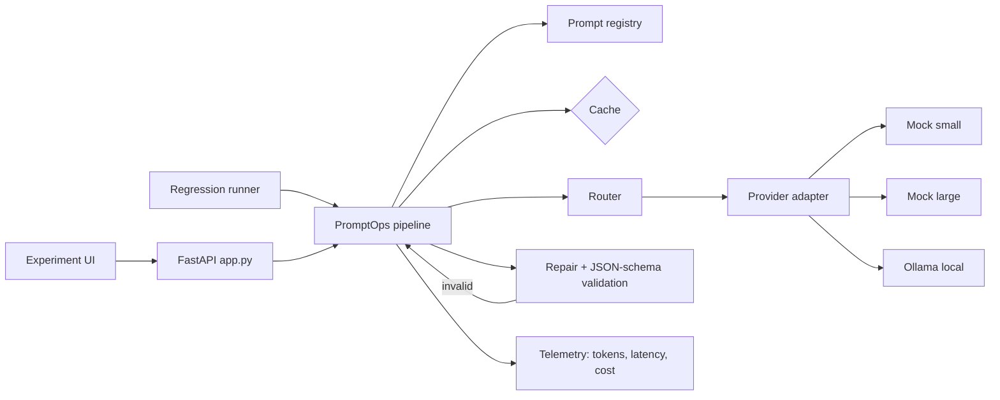

# Architecture

Request flow: render versioned prompt -> check cache -> router returns an ordered model chain -> call model (streaming optional, timeout enforced)
-> deterministic repair (strip fences, extract object, drop trailing commas) -> schema validation -> on failure retry with the validation error appended
(max 2 retries) -> on timeout/provider error or exhausted retries move to the next model -> record telemetry -> cache successful result.

## Design decisions

1. **One `Provider` interface (`complete`, `stream`)**; the pipeline only knows `ModelConfig` (tier, price). New backend = one class + one dict entry.
2. **Mock backend with controllable quality.** Failure rates depend on model tier and on prompt strictness, so prompt/model comparisons are reproducible and free. Failure tags in input text inject malformed JSON, timeouts and interrupted streams.
3. **Repair before retry.** Repairs are free and deterministic; retries cost tokens. Structural errors go back to the model with the exact validator message.
4. **Timeouts are not retried on the same model** (a slow model will likely be slow again); they go straight to the fallback chain.
5. **Schema checks structure; a separate checker tests instructions** (word limits, counts). This keeps "valid JSON" and "did what was asked" as distinct reported metrics.
6. **Routing is a readable rule**, not learned: `quality` or complex task (content_pack) -> large first; `cost`/`speed`/simple tasks -> cheapest first. Remaining models form the fallback chain.
7. **Contradictory instructions are flagged, not blocked**: the first-stated constraint wins and the response carries a warning.
8. **Cache key = model + fully rendered prompt**, so any prompt-version or input change misses correctly; only validated results are cached.
9. **Regression is a test**: `tests/test_regression.py` fails CI if pass rate, prompt-v2 advantage or router savings regress.
